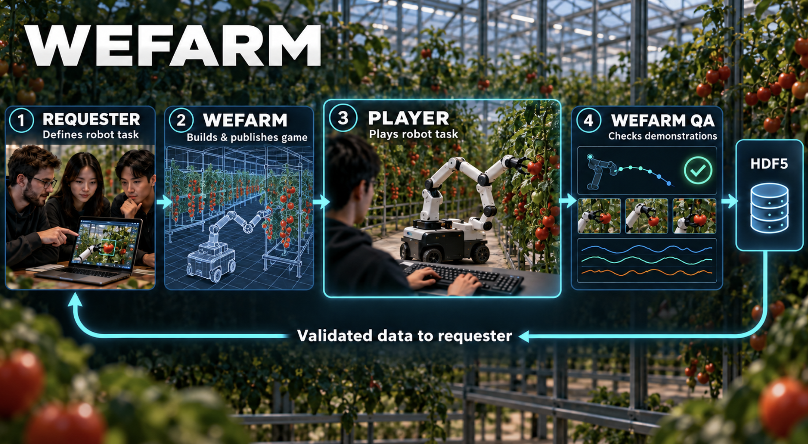
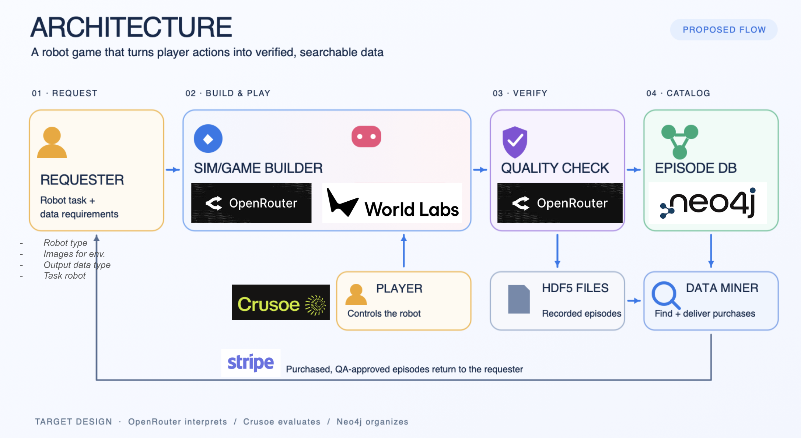

# WeFarm

**Play the harvest. Capture robot data.**





**What runs today:** the two images are concept visuals. The browser game has **one Franka Panda arm on a wheeled cart** and records **`.jsonl.gz`**, not HDF5. An uploaded farm photo is stored with the request; the demo opens a prepared World Labs greenhouse and a procedural MuJoCo work cell. OpenRouter interprets requests and reviews QA evidence, while Crusoe is the optional AI Player VLM. Neo4j indexes metadata when configured; recording files stay in local storage.

## Try it on localhost

This path needs **no API keys**. Use a macOS or Linux terminal with Python 3.12+, Node.js 22+, npm, and `uv`.

```bash
git clone https://github.com/Sehyeogkim/AI_conference_HACKDAY26_0929.git
cd AI_conference_HACKDAY26_0929
uv venv .venv
uv pip install --python .venv/bin/python -r requirements.txt
npm ci --prefix web
```

If `uv` is unavailable, replace its two lines with `python3 -m venv .venv` and `.venv/bin/python -m pip install -r requirements.txt`.

Start the **game** in terminal 1:

```bash
cd web
npm run dev -- --host 127.0.0.1 --port 5180
```

Start the **marketplace** from the repository root in terminal 2:

```bash
WEFARM_DEMO_CACHE=1 .venv/bin/python -m agriphilo.web --host 127.0.0.1 --port 8765 --demo
```

Open **[WeFarm](http://127.0.0.1:8765/)**. Choose Requester or Player on the landing page; use **Switch role** if that browser already has a demo identity. The simulator is also available directly at [localhost:5180](http://127.0.0.1:5180/).

| Demo step | What to do |
| --- | --- |
| 1. Publish | As **Requester**, click **New farm request → Use example → Publish game**. The example photo and brief are bundled in the repository. |
| 2. Play | As **Player**, open the new marketplace listing and click **Play**. In the game, click **Record**, harvest a ripe tomato, then click **Stop & submit**. |
| 3. Inspect | Return to the Requester marketplace, open the listing, and inspect **Submitted episodes**, the QA state, and the **Watch** link. The Player page also shows the submitted run. |
| 4. Watch a sample | Open [the bundled sample replay](http://127.0.0.1:8765/watch/sample) if you want to see a completed recording before playing. It is a sample, not a new marketplace submission. |

The first game load may download the public `crete-path/v2` greenhouse. If that asset is unavailable, the procedural work cell remains playable; `http://127.0.0.1:5180/?world=none` opens it directly. The [simulator guide](docs/simulator.md) has controls and a first-harvest recipe.

### Docker option

If Docker is available, run `docker compose up -d web marketplace` and open [localhost:8765](http://127.0.0.1:8765/). The optional marketplace key file is `../.env.secrets.marketplace`; start from [.env.secrets.marketplace.example](.env.secrets.marketplace.example) and keep the filled copy outside this repository. Docker uses cached demo responses by default.

## How a recording becomes data

1. A requester submits a farm image and data brief. WeFarm publishes a task and marketplace listing using a prepared simulator scene. OpenRouter can interpret the brief; without it, a fixed task template is used.
2. A human controls the browser MuJoCo robot, or the optional Crusoe AI Mode sends separate head and wrist camera images to its VLM for bounded actions. The game records states, actions, timing, and harvest events in `.jsonl.gz`.
3. Server-side structural checks and MuJoCo replay enforce measurable gates. OpenRouter evaluates the supplied evidence; its response cannot override a failed gate.
4. An **approved live QA** episode can be indexed as metadata in Neo4j, selected by Data Miner, purchased with test credits, and downloaded by the requester. The recording file remains in local storage.

**Demo mode boundary:** `WEFARM_DEMO_CACHE=1` replays stored OpenRouter text so the UI works without a key. Cached QA cannot approve a new episode: it stays **pending review** or fails a hard gate, so it cannot be sold or downloaded. To test live QA, configure `OPENROUTER_API_KEY` and start the marketplace with `WEFARM_DEMO_CACHE=0`. Neo4j is optional and independent of the cache setting; without it, the local episode index still works.

Crusoe AI Mode needs `CRUSOE_API_KEY` for Serverless vision inference, or `CRUSOE_VLM_ENDPOINT`, `CRUSOE_VLM_MODEL`, and `CRUSOE_VLM_API_KEY` for a dedicated compatible server. `NEO4J_URI`, `NEO4J_USERNAME`, and `NEO4J_PASSWORD` enable graph indexing. `STRIPE_SECRET_KEY` enables **Stripe test-mode** Checkout; credits are test credits, not cash payouts. Keep all keys out of Git.

## Scope and evidence

- The game runs MuJoCo in the browser and renders with three.js. The visible greenhouse is a prepared World Labs Marble scene; the request image does **not** generate a new 3D farm in this repository.
- Local Python tests, TypeScript checks, Vite build, and a headless MuJoCo harvest smoke test have passed. A live Crusoe call returned a bounded action from separate head and wrist images; a complete autonomous harvest has not been verified.
- The `.jsonl.gz` tomato game is the active path. The RoboCasa/HDF5 coffee demo under `sim/web` is legacy and uses a different data contract.

More detail: [architecture and limits](final_architecutre.md) · [QA contract](openroture_QA.md) · [AI Player](crusoe_player.md) · [simulator and asset credits](docs/simulator.md).
