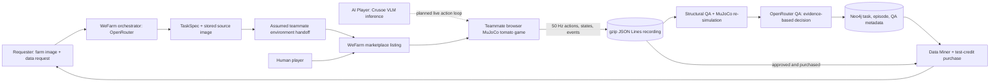

# WeFarm — Final Architecture

This document describes the **current hackathon integration** and its explicit
handoff assumption. The teammate's browser MuJoCo simulator is the source of
truth for the tomato farm game. WeFarm supplies the requester site, marketplace,
recording intake, QA, sponsor integrations, and test-credit purchase flow.

## The environment handoff

The requester uploads an image and describes the wanted tomato-harvesting
data. WeFarm stores the original image and uses OpenRouter to extract a bounded
task specification. **This API does not turn that image into a 3D farm.** For
the hackathon, it publishes the teammate's supplied simulator template as if
the environment handoff has completed. The browser checks
`data/worlds/crete-path/v2/` for a local World Labs package and
otherwise downloads the public `crete-path/v2` package from the teammate's S3
bucket. If neither loads, it shows procedural plants on a flat work cell. The
splat is a visual background; MuJoCo physics uses the generated farm layout.

## Runtime and data contract

1. `POST /api/wefarm/requests` stores the image and request, calls OpenRouter
   when configured, and publishes a `wf-*` marketplace game. The robot, farm
   task, and simulator are server-owned constants; model output can refine the
   objective, requested episode count, and quality requirements.
2. A player opens `/games/wefarm/<game_id>`. WeFarm redirects to the teammate
   Vite app with the game ID, player ID, and recording submission URL.
3. The browser runs MuJoCo with a Franka Panda arm on a movable cart. Stopping
   recording posts the native `.jsonl.gz` file to WeFarm. The original file is
   stored unchanged. Each step includes the operator command, actuator targets,
   `qpos`, and attached tomato stems; the file also includes events, periodic
   full states, a scene hash, and footer totals.
4. WeFarm checks the recording structure and event totals. A Node replay
   worker rebuilds the same scene and re-simulates the recorded commands,
   comparing state, actuator targets, attachments, checkpoints, and events.
   A failed or unavailable replay cannot earn a reward or be sold.
5. The QA Agent sends **bounded measured QA evidence** to OpenRouter, not the
   image or full recording. Structural integrity, replay, task completion,
   and exact-duplicate checks are server-enforced hard gates. Approval requires
   those gates and a validated OpenRouter `accept`; an unavailable or invalid
   model response leaves the episode pending. A failed hard gate cannot be
   overturned by the model.
6. Neo4j stores task, episode, QA, and purchase metadata with relationships.
   Original recordings stay in file storage with SHA-256 checks. Data Miner
   filters approved, purchased episodes and returns links to the original
   `.jsonl.gz` files. The local JSON index remains a recovery fallback when
   Neo4j is unavailable.
7. Existing Stripe Checkout and the test-credit ledger remain the payment
   flow. Player rewards and purchases are **test credits**, not cash payouts.
8. The browser AI Mode and backend adapter are implemented for a Crusoe-hosted
   VLM to see game frames and return one bounded action. They use the same
   `.jsonl.gz` recording and QA path as a human. A live
   frame-to-inference-to-action loop has not been verified because the local
   Crusoe endpoint and model are not configured.

## Sponsor roles

| Sponsor | Applied role | Failure behavior |
| --- | --- | --- |
| OpenRouter | Interpret requester input and evaluate measured QA evidence | Use the fixed tomato task template for request interpretation; keep QA pending if model output is unavailable or invalid |
| Crusoe | Host AI Player VLM inference for bounded game actions | Show AI Mode as unavailable; human play remains available |
| Neo4j AuraDB | Index task, episode, QA, and purchase relationships for Data Miner | Retain local metadata; expose the fallback honestly |

## Important limits

- The submitted image is **not** validated against the generated farm layout.
- The current teammate simulator uses a close-range grasp-assist constraint;
  the cart's wheels are visual, while cart movement uses position servos.
- A browser replay that merely poses saved `qpos` is for human inspection. The
  server's separate re-simulation determines replay QA.
- A `.jsonl.gz` recording is the current deliverable. The older RoboCasa HDF5
  coffee/tomato adapter under `sim/web` remains legacy and is not used as proof
  for this game. The active browser game is under `web`.
- Player identity is a demo identifier from the site's local sign-in UI; it is
  not production authentication.
- OpenRouter QA and Crusoe AI Player code have local tests. One synthetic
  OpenRouter QA request succeeded; full game submission and the combined AI
  Mode flow have not been verified. Do not present
  the AI Player as live until a frame, model response, game action, and native
  recording have been observed together.

Official API references: [OpenRouter](https://openrouter.ai/docs/api_reference/overview),
[Crusoe](https://docs.crusoecloud.com/quickstart/getting-started-with-serverless-inference/),
[Neo4j Python driver](https://neo4j.com/docs/python-manual/current/connect/).
